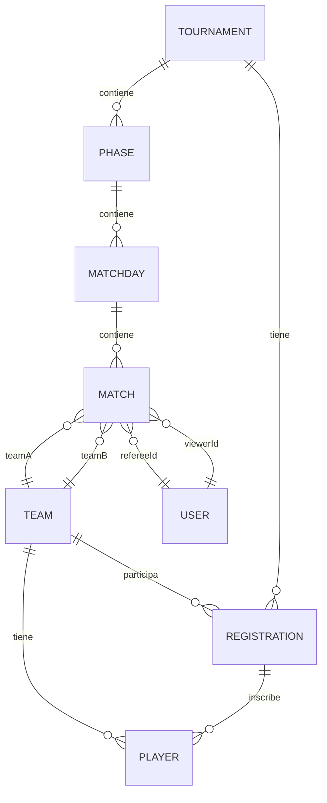

# Mapa de Entidades - Backend

Este documento describe las entidades principales del backend, sus relaciones y los datos que poseen, basado en la estructura del proyecto.

## Entidades principales

- **Tournament (Torneo)**
- **Phase (Fase)**
- **Matchday (Jornada/Fecha)**
- **Match (Partido)**
- **Team (Equipo)**
- **Player (Jugador)**
- **Registration (Inscripción)**
- **User (Usuario)**

---

### 1. Tournament (`tournament.entity.ts`)

- **Datos**: nombre, fecha de inicio/fin, estado, etc.
- **Relaciones**:
  - Tiene muchas fases (`Phase`)
  - Tiene muchas inscripciones (`Registration`)
  - Puede tener muchos equipos a través de inscripciones

---

### 2. Phase (`phase.entity.ts`)

- **Datos**: nombre, tipo (grupos, eliminación, etc.), orden, etc.
- **Relaciones**:
  - Pertenece a un torneo (`Tournament`)
  - Tiene muchas jornadas/fechas (`Matchday`)
  - Puede tener muchos partidos a través de jornadas

---

### 3. Matchday (`matchday.entity.ts`)

- **Datos**: número de jornada, fecha, etc.
- **Relaciones**:
  - Pertenece a una fase (`Phase`)
  - Tiene muchos partidos (`Match`)

---

### 4. Match (`match.entity.ts`)

- **Datos**: fecha, hora, marcador, eventos, estado, etc.
- **Relaciones**:
  - Pertenece a una jornada (`Matchday`)
  - Tiene dos equipos (`Team` como teamA y teamB)
  - Puede tener árbitro y veedor (`User`)
  - Tiene muchos eventos (goles, tarjetas, etc.)
  - Tiene muchos jugadores a través de eventos

---

### 5. Team (`team.entity.ts`)

- **Datos**: nombre, escudo, color, etc.
- **Relaciones**:
  - Tiene muchos jugadores (`Player`)
  - Puede estar inscrito en muchos torneos a través de inscripciones (`Registration`)
  - Participa en muchos partidos (`Match`)

---

### 6. Player (`player.entity.ts`)

- **Datos**: nombre, dorsal, posición, estadísticas, etc.
- **Relaciones**:
  - Pertenece a un equipo (`Team`)
  - Puede estar inscrito en muchos torneos a través de inscripciones
  - Participa en muchos partidos a través de eventos

---

### 7. Registration (`registration.entity.ts`)

- **Datos**: estadísticas del equipo en el torneo, estado, etc.
- **Relaciones**:
  - Relaciona un equipo (`Team`) con un torneo (`Tournament`)
  - Puede tener jugadores inscritos

---

### 8. User (`user.entity.ts`)

- **Datos**: nombre, email, rol (admin, árbitro, veedor, etc.), etc.
- **Relaciones**:
  - Puede ser árbitro o veedor en partidos (`Match`)
  - Puede estar vinculado a un jugador

---

## Relaciones entre entidades (diagrama Mermaid)

---

## Notas sobre relaciones internas

- Cada entidad suele tener referencias a otras mediante IDs (por ejemplo, `teamId`, `tournamentId`, etc.).
- Si dentro de un entity hay más de una clase, normalmente es para subdocumentos o estructuras internas (por ejemplo, estadísticas, eventos de partido, etc.).
- Ejemplo: en `match.entity.ts` podrías tener una clase `MatchEvent` (para los eventos del partido) como subdocumento dentro de `Match`, o una clase `Stats` dentro de `Player` o `Team` para estadísticas.

---

## Diagrama visual (PNG)

---
